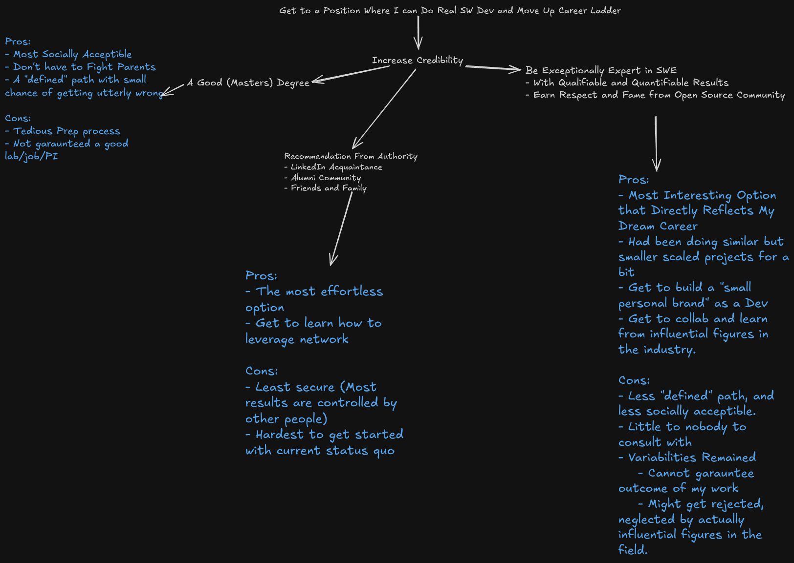

# 07/16
Questions to ponder
1. 你想什麼時候去讀碩士（繼續進修），請給出明確的年份？  
Ans: 2027 fall ~ 2028 fall, the earlier the better.
2. 你想去哪裡繼續進修？  
Ans: 如果可以再出國，首選出國，不行才留下來。
3. 你想從目前的工作學到/得到/知道什麼？  
Ans: I want to know
    1. What the industry (at least in Taiwan) wants.
    2. What can I solve at the moment, and what do I need to advance in this path.
    3. How to work along side engineers.
